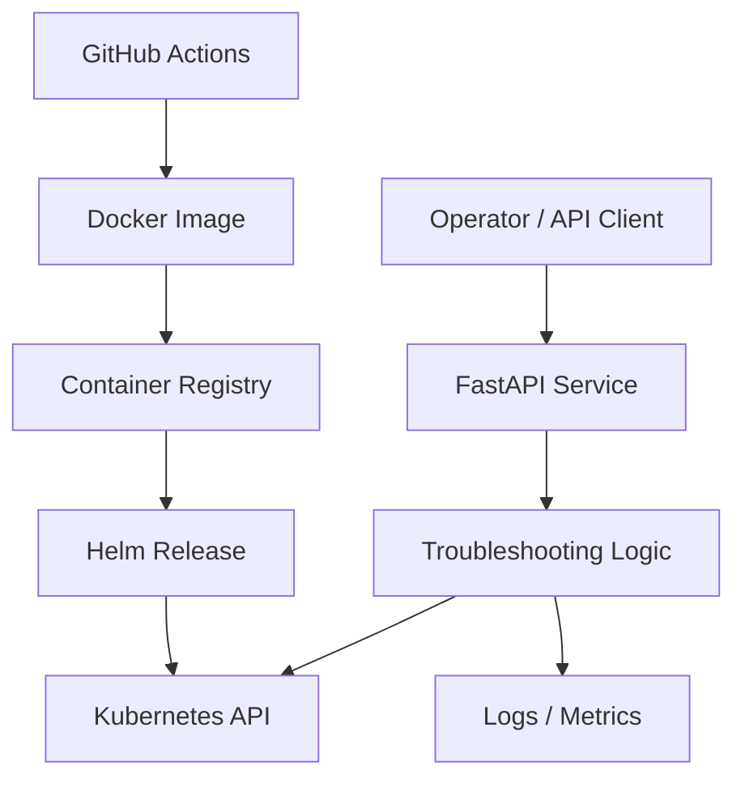

# Architecture

```mermaid
flowchart TB
    User[Operator / API Client] --> Api[FastAPI Service]
    Api --> Triage[Troubleshooting Logic]
    Triage --> K8s[Kubernetes API]
    Triage --> Telemetry[Logs / Metrics]
    CI[GitHub Actions] --> Image[Docker Image]
    Image --> Registry[Container Registry]
    Registry --> Helm[Helm Release]
    Helm --> K8s
```
